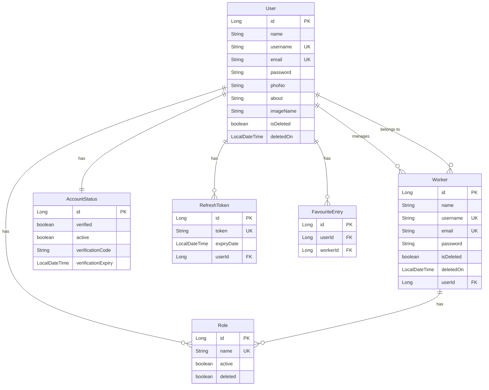

# Tutoreals-Managments Application Overview

## 📋 Executive Summary

This is a **Spring Boot User Management System** (named "User-Master") that provides comprehensive user administration capabilities with enterprise-level features. The application implements JWT-based authentication, role-based access control (RBAC), and advanced user management including worker management, email verification, password reset, and more.

---

## 🏗️ Architecture Overview

### Technology Stack

| Component | Technology | Version |
|-----------|-----------|---------|
| **Framework** | Spring Boot | 3.4.1 |
| **Language** | Java | 21 |
| **Build Tool** | Gradle | 7.x+ |
| **Database** | MySQL | 8.x |
| **Security** | Spring Security + JWT | - |
| **ORM** | JPA/Hibernate | - |
| **API Documentation** | Springdoc OpenAPI | 2.7.0 |
| **Email** | Spring Mail | - |
| **Validation** | Spring Validation | - |

### Project Structure

```
src/main/java/com/vijay/User_Master/
├── controller/          # REST API endpoints
│   ├── AuthController.java
│   ├── UserController.java
│   ├── WorkerUserController.java
│   ├── RoleController.java
│   ├── HomeController.java
│   ├── RefreshTokenController.java
│   ├── ChatIntegrationController.java
│   └── McpIntegrationController.java
├── service/            # Business logic layer
│   ├── impl/          # Service implementations
│   └── generics/      # Generic service interfaces
├── repository/         # Data access layer (JPA repositories)
├── entity/            # JPA entities
│   ├── User.java
│   ├── Worker.java
│   ├── Role.java
│   ├── AccountStatus.java
│   ├── RefreshToken.java
│   ├── FavouriteEntry.java
│   └── BaseModel.java
├── dto/               # Data Transfer Objects
│   └── form/         # Form DTOs
├── config/            # Configuration classes
│   └── security/     # Security configuration
├── exceptions/        # Custom exception handling
│   └── exception/    # Exception classes
└── Helper/            # Utility classes
```

---

## 🔐 Core Features

### 1. Authentication & Authorization

#### JWT Token-Based Authentication
- **Access Token**: Short-lived JWT tokens (7 days expiration)
- **Refresh Token**: Long-lived tokens for obtaining new access tokens
- **Token Algorithm**: HS384
- **Secure Logout**: Token invalidation mechanism

#### Role-Based Access Control (RBAC)
The system supports 4 distinct user roles:

| Role | Description | Access Level |
|------|-------------|--------------|
| `ROLE_ADMIN` | Full system administration | Highest |
| `ROLE_SUPER_USER` | Extended user management | High |
| `ROLE_NORMAL` | Standard user permissions | Medium |
| `ROLE_WORKER` | Specialized worker access | Limited |

### 2. User Management

#### Core User Operations
- ✅ Create, Read, Update, Delete (CRUD) users
- ✅ Profile management with personal information
- ✅ Profile picture upload (max 10MB)
- ✅ Account status management (active/inactive)
- ✅ Soft delete pattern (data preservation)
- ✅ Asynchronous processing with CompletableFuture
- ✅ Advanced filtering and search
- ✅ Pagination and sorting

#### User Entity Structure
```java
User {
    - id: Long
    - name: String
    - username: String (unique)
    - email: String (unique)
    - password: String (encrypted)
    - phoNo: String
    - about: String
    - imageName: String
    - isDeleted: boolean
    - deletedOn: LocalDateTime
    - roles: Set<Role>
    - workers: List<Worker>
    - accountStatus: AccountStatus
}
```

### 3. Worker Management

Workers are specialized users managed by SuperUsers. Features include:

- ✅ Worker CRUD operations
- ✅ Soft delete with recycle bin
- ✅ Restore from recycle bin
- ✅ Permanent deletion
- ✅ Status management (active/inactive)
- ✅ Advanced filtering by SuperUser
- ✅ Favorite worker lists
- ✅ Search and pagination

### 4. Email Verification & Account Management

#### Account Verification Flow
1. User registers → Account created with INACTIVE status
2. Verification email sent with activation link
3. User clicks link → Account activated

#### Password Reset Flow
1. User requests password reset
2. Email sent with secure token
3. User submits new password with token
4. Password updated and token invalidated

#### Account Unlock Flow
1. User requests forgot password
2. Temporary password generated and emailed
3. User unlocks account with temp password
4. User sets new permanent password

---

## 🌐 API Endpoints

### Authentication Endpoints

```http
POST   /api/auth/login              # User login (JWT + refresh token)
POST   /api/auth/register           # User registration
POST   /api/auth/refresh-token      # Refresh access token
POST   /api/auth/logout             # Invalidate refresh token
PUT    /api/auth/change-password    # Change password (authenticated)
```

### User Management Endpoints

```http
# User CRUD
POST   /api/users                   # Create new user
GET    /api/users                   # Get all users (paginated)
GET    /api/users/{id}              # Get user by ID
PUT    /api/users/{id}              # Update user
DELETE /api/users/{id}              # Soft delete user

# Profile Management
GET    /api/users/me                # Get current user profile
PUT    /api/users/me                # Update current user profile
PATCH  /api/users/me/status         # Update account status
POST   /api/users/me/avatar         # Upload profile picture
DELETE /api/users/me/avatar         # Remove profile picture

# Filtering & Search
GET    /api/users/filter            # Advanced filtering
GET    /api/users/active            # Get active users only
GET    /api/users/inactive          # Get inactive users only
```

### Worker Management Endpoints

```http
# Worker CRUD
GET    /api/v1/workers                          # Get all workers
GET    /api/v1/workers/{id}                     # Get worker by ID
DELETE /api/v1/workers/{id}                     # Soft delete (recycle bin)
PATCH  /api/v1/workers/{id}/restore             # Restore from recycle bin
DELETE /api/v1/workers/{id}/permanent           # Permanent delete

# Worker Status & Search
PATCH  /api/v1/workers/{id}/status              # Update status
GET    /api/v1/workers/active                   # Get active workers
GET    /api/v1/workers/search                   # Search workers
GET    /api/v1/workers/recycle                  # Get recycle bin
DELETE /api/v1/workers/recycle/delete-all       # Empty recycle bin

# SuperUser Management
GET    /api/v1/workers/superuser/{id}           # Get workers by SuperUser
GET    /api/v1/workers/superuser/{id}/filter    # Filter workers
GET    /api/v1/workers/superuser/{id}/advanced-filter  # Advanced filtering

# Favorites
GET    /api/v1/workers/favorite-list            # Get favorite workers
POST   /api/v1/workers/favorite/{workerId}      # Add to favorites
DELETE /api/v1/workers/favorite/{id}            # Remove from favorites
```

### Email & Account Management Endpoints

```http
# Account Verification
GET    /api/v1/home/verify                      # Verify account via email
POST   /api/v1/home/unlock-account              # Unlock with temp password

# Password Management
GET    /api/v1/home/send-email-reset            # Send password reset email
GET    /api/v1/home/verify-pswd-link            # Verify reset link
POST   /api/v1/home/reset-password              # Reset password
POST   /api/v1/home/forgot-password             # Request forgot password
```

### Role Management Endpoints (Admin Only)

```http
# Role CRUD
GET    /api/roles                               # Get all roles
POST   /api/roles                               # Create role
GET    /api/roles/active                        # Get active roles
PATCH  /api/roles/{id}                          # Update role
PATCH  /api/roles/{id}/activate                 # Activate role
PATCH  /api/roles/{id}/deactivate               # Deactivate role
DELETE /api/roles/{id}                          # Delete role

# User Role Assignment
POST   /api/roles/assign                        # Assign roles to user
POST   /api/roles/remove                        # Remove roles from user
PUT    /api/roles/replace                       # Replace all user roles
GET    /api/roles/user/{userId}                 # Get user's roles
GET    /api/roles/{id}/exists                   # Check if role exists
```

---

## 🔧 Configuration

### Database Configuration
```properties
spring.datasource.url=jdbc:mysql://localhost:3306/user-master
spring.datasource.username=root
spring.datasource.password=root
spring.jpa.hibernate.ddl-auto=update
```

### JWT Configuration
```properties
app.jwt-secret=daf66e01593f61a15b857cf433aae03a005812b31234e149036bcc8dee755dbb
app-jwt-expiration-milliseconds=604800000  # 7 days
```

### Email Configuration
```properties
spring.mail.host=smtp.gmail.com
spring.mail.port=587
spring.mail.username=omvijay44@gmail.com
spring.mail.properties.mail.smtp.auth=true
spring.mail.properties.mail.smtp.starttls.enable=true
```

### File Upload Configuration
```properties
user.profile.image.path=images/users/
spring.servlet.multipart.max-file-size=10MB
spring.servlet.multipart.max-request-size=10MB
```

### Server Configuration
```properties
server.port=9091
server.forward-headers-strategy=framework
server.tomcat.connection-timeout=20000
server.tomcat.keep-alive-timeout=20000
```

### API Documentation
```properties
springdoc.api-docs.enabled=true
springdoc.swagger-ui.enabled=true
springdoc.packages-to-scan=com.vijay.User_Master.controller
springdoc.paths-to-match=/api/**
```

**Access Swagger UI**: http://localhost:9091/swagger-ui/index.html

---

## 🚀 Getting Started

### Prerequisites
- Java 21 or higher
- MySQL 8.x database
- Gradle 7.x or higher

### Installation Steps

1. **Clone the repository**
   ```bash
   git clone https://github.com/RathodVijay9524/User-Master.git
   cd User-Master
   ```

2. **Configure database**
   - Create database: `CREATE DATABASE user_master;`
   - Update `application.properties` with your credentials

3. **Build and run**
   ```bash
   ./gradlew build
   ./gradlew bootRun
   ```

4. **Access the application**
   - Base URL: `http://localhost:9091`
   - Swagger UI: `http://localhost:9091/swagger-ui/index.html`

### Default Users (Created on First Run)

| Username | Password | Role | Email |
|----------|----------|------|-------|
| admin | admin | ROLE_ADMIN | admin@gmail.com |
| user | user | ROLE_SUPER_USER | user@gmail.com |
| normal | normal | ROLE_NORMAL | normal@gmail.com |
| worker | worker | ROLE_WORKER | worker@gmail.com |

---

## 📊 Data Model

### Core Entities



---

## 🎯 Advanced Features

### 1. Soft Delete Pattern
- Users/Workers marked as deleted instead of physical removal
- Maintains data integrity and audit trails
- Recycle bin functionality for recovery
- Permanent delete option available

### 2. Asynchronous Processing
- Non-blocking operations using CompletableFuture
- Improved performance and scalability
- Used for user creation, updates, and email sending

### 3. Comprehensive Filtering
- Filter by active/inactive status
- Filter by deleted/non-deleted
- Keyword search across multiple fields
- Combinable filters for complex queries
- Pagination and sorting support

### 4. Email Integration
- Account verification emails
- Password reset emails
- Temporary password generation
- Customizable email templates

### 5. Security Features
- BCrypt password encryption
- JWT token-based authentication
- Refresh token mechanism
- Token invalidation on logout
- Role-based access control
- CORS configuration
- Forward headers strategy for proxy support

---

## 📝 Usage Examples

### Login Request
```bash
POST http://localhost:9091/api/auth/login
Content-Type: application/json

{
  "usernameOrEmail": "admin",
  "password": "admin"
}
```

### Login Response
```json
{
  "responseStatus": "OK",
  "status": "success",
  "message": "Login successful",
  "data": {
    "jwtToken": "eyJhbGciOiJIUzM4NCJ9...",
    "refreshToken": {
      "token": "eyJhbGciOiJIUzM4NCJ9...",
      "expiryDate": "2025-08-15T12:34:56.789Z"
    },
    "user": {
      "id": 1,
      "name": "Vimal Kumar",
      "username": "admin",
      "email": "admin@gmail.com",
      "roles": [{"name": "ROLE_ADMIN"}],
      "active": true
    }
  }
}
```

### Create User
```bash
POST http://localhost:9091/api/users
Authorization: Bearer {jwt_token}
Content-Type: application/json

{
  "name": "John Doe",
  "username": "johndoe",
  "email": "john@example.com",
  "password": "securePassword123"
}
```

### Filter Users
```bash
# Get active users with pagination
GET http://localhost:9091/api/users/filter?isActive=true&pageNumber=0&pageSize=10&sortBy=name&sortDir=asc
Authorization: Bearer {jwt_token}
```

---

## 🔍 Additional Features

### Chat Integration
- Integration with external chat service
- Base URL: `http://localhost:8080`
- Timeout: 30 seconds
- Debug logging enabled

### MCP Integration
- Model Context Protocol integration controller
- Extensible for AI/ML integrations

### Kubernetes Deployment
- K8s deployment configurations available
- See `KUBERNETES_DEPLOYMENT.md` for details

---

## 📚 Documentation Files

The project includes several comprehensive documentation files:

1. **README.md** - Main project documentation
2. **APPLICATION_MANAGEMENT.md** - Application management guide
3. **ROLE_MANAGEMENT_GUIDE.md** - Role management documentation
4. **ROLE_MANAGEMENT_EXAMPLES.md** - Role management examples
5. **KUBERNETES_DEPLOYMENT.md** - Kubernetes deployment guide
6. **QUICK_START_STOP.md** - Quick start/stop guide

---

## 🎨 Design Patterns Used

1. **Layered Architecture**: Controller → Service → Repository → Entity
2. **DTO Pattern**: Data Transfer Objects for API communication
3. **Builder Pattern**: Entity construction (Lombok @Builder)
4. **Repository Pattern**: Data access abstraction
5. **Dependency Injection**: Spring's IoC container
6. **Soft Delete Pattern**: Logical deletion with recovery
7. **Auditing Pattern**: Automatic timestamp tracking

---

## 🔒 Security Considerations

- ✅ Password encryption using BCrypt
- ✅ JWT token-based stateless authentication
- ✅ Refresh token rotation
- ✅ Token invalidation on logout
- ✅ Role-based access control
- ✅ Email verification for new accounts
- ✅ Secure password reset mechanism
- ✅ HTTPS support via forward headers
- ✅ Input validation
- ✅ SQL injection prevention (JPA/Hibernate)

---

## 📈 Scalability Features

- Asynchronous processing for heavy operations
- Pagination for large datasets
- Database connection pooling
- Stateless authentication (JWT)
- Soft delete for data preservation
- Efficient querying with JPA specifications

---

## 🛠️ Development Tools

- **Lombok**: Reduces boilerplate code
- **ModelMapper**: Object mapping
- **Spring DevTools**: Hot reload during development
- **Springdoc OpenAPI**: Interactive API documentation
- **Log4j2**: Advanced logging capabilities

---

## 📞 Support & Contact

**Author**: Vijay Rathod
- GitHub: [@RathodVijay9524](https://github.com/RathodVijay9524)
- Email: rathod@gmail.com

---

## 📄 License

This project is licensed under the MIT License.
