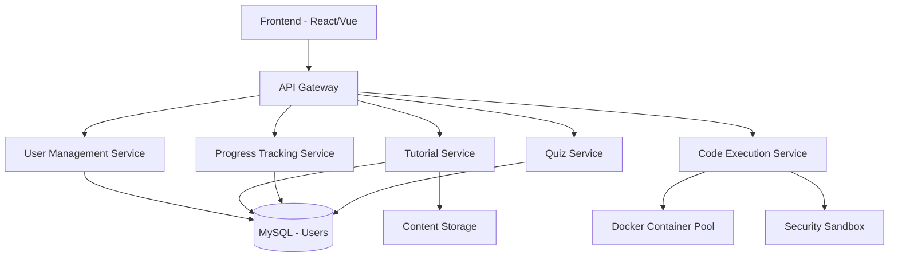

# Java Tutorial Platform Implementation Plan

## Overview

Transform the existing User Management system into a comprehensive **Java Tutorial Platform** similar to W3Schools, GeeksforGeeks, and Programiz. The platform will provide interactive Java tutorials, code execution, quizzes, progress tracking, and community features.

---

## 🎯 Project Goals

1. **Leverage Existing System**: Use the current user management, authentication, and role system
2. **Tutorial Content Management**: Create, organize, and deliver Java tutorials
3. **Interactive Learning**: Code editor with live execution
4. **Progress Tracking**: Track user learning progress and achievements
5. **Assessment System**: Quizzes and coding challenges
6. **Community Features**: Comments, discussions, and user contributions

---

## 📊 Proposed Architecture

### System Components



---

## 🗄️ Database Schema Design

### New Entities Required

#### 1. Tutorial Category
```java
@Entity
@Table(name = "tutorial_categories")
public class TutorialCategory {
    @Id
    @GeneratedValue(strategy = GenerationType.IDENTITY)
    private Long id;
    
    private String name;              // "Core Java", "Advanced Java", etc.
    private String slug;              // URL-friendly name
    private String description;
    private String icon;              // Icon/image path
    private Integer displayOrder;
    private boolean isActive;
    
    @ManyToOne
    @JoinColumn(name = "parent_id")
    private TutorialCategory parent;  // For subcategories
    
    @OneToMany(mappedBy = "parent")
    private List<TutorialCategory> subCategories;
    
    @OneToMany(mappedBy = "category")
    private List<Tutorial> tutorials;
}
```

#### 2. Tutorial
```java
@Entity
@Table(name = "tutorials")
public class Tutorial {
    @Id
    @GeneratedValue(strategy = GenerationType.IDENTITY)
    private Long id;
    
    private String title;
    private String slug;
    
    @Column(columnDefinition = "TEXT")
    private String content;           // Markdown/HTML content
    
    @Column(columnDefinition = "TEXT")
    private String codeExample;       // Sample code
    
    private String difficulty;        // BEGINNER, INTERMEDIATE, ADVANCED
    private Integer estimatedMinutes; // Reading time
    private Integer displayOrder;
    
    @ManyToOne
    @JoinColumn(name = "category_id")
    private TutorialCategory category;
    
    @ManyToOne
    @JoinColumn(name = "author_id")
    private User author;
    
    private boolean isPublished;
    private LocalDateTime publishedAt;
    
    @OneToMany(mappedBy = "tutorial")
    private List<CodeSnippet> codeSnippets;
    
    @OneToMany(mappedBy = "tutorial")
    private List<UserProgress> userProgress;
    
    @OneToMany(mappedBy = "tutorial")
    private List<Comment> comments;
    
    // SEO fields
    private String metaTitle;
    private String metaDescription;
    private String keywords;
}
```

#### 3. Code Snippet
```java
@Entity
@Table(name = "code_snippets")
public class CodeSnippet {
    @Id
    @GeneratedValue(strategy = GenerationType.IDENTITY)
    private Long id;
    
    @ManyToOne
    @JoinColumn(name = "tutorial_id")
    private Tutorial tutorial;
    
    private String title;
    
    @Column(columnDefinition = "TEXT")
    private String code;
    
    @Column(columnDefinition = "TEXT")
    private String expectedOutput;
    
    private boolean isExecutable;
    private boolean isEditable;
    private Integer displayOrder;
}
```

#### 4. User Progress
```java
@Entity
@Table(name = "user_progress")
public class UserProgress {
    @Id
    @GeneratedValue(strategy = GenerationType.IDENTITY)
    private Long id;
    
    @ManyToOne
    @JoinColumn(name = "user_id")
    private User user;
    
    @ManyToOne
    @JoinColumn(name = "tutorial_id")
    private Tutorial tutorial;
    
    private boolean isCompleted;
    private Integer progressPercentage;
    private LocalDateTime startedAt;
    private LocalDateTime completedAt;
    private Integer timeSpentMinutes;
}
```

#### 5. Quiz
```java
@Entity
@Table(name = "quizzes")
public class Quiz {
    @Id
    @GeneratedValue(strategy = GenerationType.IDENTITY)
    private Long id;
    
    private String title;
    private String description;
    
    @ManyToOne
    @JoinColumn(name = "tutorial_id")
    private Tutorial tutorial;
    
    @ManyToOne
    @JoinColumn(name = "category_id")
    private TutorialCategory category;
    
    private Integer passingScore;
    private Integer timeLimit;        // in minutes
    private boolean isActive;
    
    @OneToMany(mappedBy = "quiz")
    private List<Question> questions;
}
```

#### 6. Question
```java
@Entity
@Table(name = "questions")
public class Question {
    @Id
    @GeneratedValue(strategy = GenerationType.IDENTITY)
    private Long id;
    
    @ManyToOne
    @JoinColumn(name = "quiz_id")
    private Quiz quiz;
    
    @Column(columnDefinition = "TEXT")
    private String questionText;
    
    private String questionType;      // MULTIPLE_CHOICE, TRUE_FALSE, CODE
    
    @Column(columnDefinition = "TEXT")
    private String codeSnippet;       // For code-based questions
    
    private Integer points;
    private Integer displayOrder;
    
    @OneToMany(mappedBy = "question")
    private List<Answer> answers;
}
```

#### 7. Answer
```java
@Entity
@Table(name = "answers")
public class Answer {
    @Id
    @GeneratedValue(strategy = GenerationType.IDENTITY)
    private Long id;
    
    @ManyToOne
    @JoinColumn(name = "question_id")
    private Question question;
    
    @Column(columnDefinition = "TEXT")
    private String answerText;
    
    private boolean isCorrect;
    
    @Column(columnDefinition = "TEXT")
    private String explanation;
}
```

#### 8. Quiz Attempt
```java
@Entity
@Table(name = "quiz_attempts")
public class QuizAttempt {
    @Id
    @GeneratedValue(strategy = GenerationType.IDENTITY)
    private Long id;
    
    @ManyToOne
    @JoinColumn(name = "user_id")
    private User user;
    
    @ManyToOne
    @JoinColumn(name = "quiz_id")
    private Quiz quiz;
    
    private Integer score;
    private Integer totalQuestions;
    private boolean isPassed;
    
    private LocalDateTime startedAt;
    private LocalDateTime completedAt;
    private Integer timeSpentMinutes;
    
    @OneToMany(mappedBy = "attempt")
    private List<UserAnswer> userAnswers;
}
```

#### 9. User Answer
```java
@Entity
@Table(name = "user_answers")
public class UserAnswer {
    @Id
    @GeneratedValue(strategy = GenerationType.IDENTITY)
    private Long id;
    
    @ManyToOne
    @JoinColumn(name = "attempt_id")
    private QuizAttempt attempt;
    
    @ManyToOne
    @JoinColumn(name = "question_id")
    private Question question;
    
    @ManyToOne
    @JoinColumn(name = "answer_id")
    private Answer selectedAnswer;
    
    private boolean isCorrect;
    private Integer pointsEarned;
}
```

#### 10. Comment
```java
@Entity
@Table(name = "comments")
public class Comment {
    @Id
    @GeneratedValue(strategy = GenerationType.IDENTITY)
    private Long id;
    
    @ManyToOne
    @JoinColumn(name = "tutorial_id")
    private Tutorial tutorial;
    
    @ManyToOne
    @JoinColumn(name = "user_id")
    private User user;
    
    @ManyToOne
    @JoinColumn(name = "parent_id")
    private Comment parent;           // For replies
    
    @Column(columnDefinition = "TEXT")
    private String content;
    
    private boolean isApproved;
    private Integer upvotes;
    private Integer downvotes;
    
    @OneToMany(mappedBy = "parent")
    private List<Comment> replies;
}
```

#### 11. Code Execution Log
```java
@Entity
@Table(name = "code_execution_logs")
public class CodeExecutionLog {
    @Id
    @GeneratedValue(strategy = GenerationType.IDENTITY)
    private Long id;
    
    @ManyToOne
    @JoinColumn(name = "user_id")
    private User user;
    
    @Column(columnDefinition = "TEXT")
    private String code;
    
    @Column(columnDefinition = "TEXT")
    private String output;
    
    @Column(columnDefinition = "TEXT")
    private String error;
    
    private String status;            // SUCCESS, ERROR, TIMEOUT
    private Integer executionTime;    // in milliseconds
    private LocalDateTime executedAt;
}
```

#### 12. Achievement
```java
@Entity
@Table(name = "achievements")
public class Achievement {
    @Id
    @GeneratedValue(strategy = GenerationType.IDENTITY)
    private Long id;
    
    private String name;
    private String description;
    private String icon;
    private String badgeColor;
    private String criteria;          // JSON criteria
    private Integer points;
}
```

#### 13. User Achievement
```java
@Entity
@Table(name = "user_achievements")
public class UserAchievement {
    @Id
    @GeneratedValue(strategy = GenerationType.IDENTITY)
    private Long id;
    
    @ManyToOne
    @JoinColumn(name = "user_id")
    private User user;
    
    @ManyToOne
    @JoinColumn(name = "achievement_id")
    private Achievement achievement;
    
    private LocalDateTime earnedAt;
}
```

---

## 🌐 New API Endpoints

### Tutorial Management APIs

```http
# Category Management (Admin/Author)
GET    /api/v1/categories                    # Get all categories
GET    /api/v1/categories/{id}               # Get category by ID
POST   /api/v1/categories                    # Create category
PUT    /api/v1/categories/{id}               # Update category
DELETE /api/v1/categories/{id}               # Delete category
GET    /api/v1/categories/{id}/tutorials     # Get tutorials in category

# Tutorial Management (Admin/Author)
GET    /api/v1/tutorials                     # Get all tutorials (paginated)
GET    /api/v1/tutorials/{id}                # Get tutorial by ID
GET    /api/v1/tutorials/slug/{slug}         # Get tutorial by slug
POST   /api/v1/tutorials                     # Create tutorial
PUT    /api/v1/tutorials/{id}                # Update tutorial
DELETE /api/v1/tutorials/{id}                # Delete tutorial
PATCH  /api/v1/tutorials/{id}/publish        # Publish tutorial
PATCH  /api/v1/tutorials/{id}/unpublish      # Unpublish tutorial

# Tutorial Search & Filter
GET    /api/v1/tutorials/search              # Search tutorials
GET    /api/v1/tutorials/category/{id}       # Get by category
GET    /api/v1/tutorials/difficulty/{level}  # Get by difficulty
GET    /api/v1/tutorials/popular             # Get popular tutorials
GET    /api/v1/tutorials/recent              # Get recent tutorials

# Code Execution
POST   /api/v1/code/execute                  # Execute Java code
POST   /api/v1/code/validate                 # Validate code syntax
GET    /api/v1/code/history                  # Get user's execution history

# Progress Tracking
GET    /api/v1/progress/me                   # Get current user progress
POST   /api/v1/progress/tutorial/{id}/start  # Mark tutorial as started
POST   /api/v1/progress/tutorial/{id}/complete # Mark tutorial as completed
GET    /api/v1/progress/stats                # Get user statistics

# Quiz Management
GET    /api/v1/quizzes                       # Get all quizzes
GET    /api/v1/quizzes/{id}                  # Get quiz by ID
POST   /api/v1/quizzes                       # Create quiz (Admin)
PUT    /api/v1/quizzes/{id}                  # Update quiz (Admin)
DELETE /api/v1/quizzes/{id}                  # Delete quiz (Admin)

# Quiz Taking
POST   /api/v1/quizzes/{id}/start            # Start quiz attempt
POST   /api/v1/quizzes/attempt/{id}/submit   # Submit quiz
GET    /api/v1/quizzes/attempt/{id}/result   # Get quiz result
GET    /api/v1/quizzes/my-attempts           # Get user's quiz attempts

# Comments
GET    /api/v1/tutorials/{id}/comments       # Get tutorial comments
POST   /api/v1/tutorials/{id}/comments       # Add comment
PUT    /api/v1/comments/{id}                 # Update comment
DELETE /api/v1/comments/{id}                 # Delete comment
POST   /api/v1/comments/{id}/upvote          # Upvote comment
POST   /api/v1/comments/{id}/downvote        # Downvote comment

# Achievements
GET    /api/v1/achievements                  # Get all achievements
GET    /api/v1/achievements/me               # Get user's achievements
GET    /api/v1/leaderboard                   # Get leaderboard
```

---

## 🎨 Frontend Components

### Page Structure

```
Frontend (React/Vue/Angular)
├── Public Pages
│   ├── Home Page
│   ├── Tutorial Listing Page
│   ├── Tutorial Detail Page
│   ├── Category Page
│   ├── Search Results Page
│   └── About/Contact Pages
│
├── User Dashboard
│   ├── My Progress
│   ├── My Achievements
│   ├── Quiz History
│   ├── Bookmarks
│   └── Profile Settings
│
├── Interactive Components
│   ├── Code Editor (Monaco/CodeMirror)
│   ├── Code Output Console
│   ├── Quiz Interface
│   ├── Progress Tracker
│   └── Comment Section
│
└── Admin Panel
    ├── Tutorial Management
    ├── Category Management
    ├── Quiz Management
    ├── User Management
    └── Analytics Dashboard
```

### Key Frontend Features

1. **Code Editor Integration**
   - Monaco Editor (VS Code editor)
   - Syntax highlighting
   - Auto-completion
   - Error detection
   - Run button with live output

2. **Tutorial Viewer**
   - Markdown rendering
   - Code syntax highlighting
   - Copy code button
   - Table of contents
   - Next/Previous navigation
   - Progress indicator

3. **Quiz Interface**
   - Multiple choice questions
   - Code-based questions
   - Timer display
   - Instant feedback
   - Score calculation

4. **Progress Dashboard**
   - Learning path visualization
   - Completion percentage
   - Time spent tracking
   - Achievement badges
   - Streak tracking

---

## 🔧 Technical Implementation Details

### 1. Code Execution Engine

> [!IMPORTANT]
> Code execution must be sandboxed for security!

**Options:**

**Option A: Docker-based Execution (Recommended)**
```java
@Service
public class CodeExecutionService {
    
    public ExecutionResult executeCode(String code, Long userId) {
        // 1. Create temporary Docker container
        // 2. Copy code to container
        // 3. Compile Java code
        // 4. Execute with timeout (5 seconds)
        // 5. Capture output/errors
        // 6. Destroy container
        // 7. Return result
    }
}
```

**Option B: JDoodle API Integration**
```java
@Service
public class JDoodleExecutionService {
    
    @Value("${jdoodle.client-id}")
    private String clientId;
    
    @Value("${jdoodle.client-secret}")
    private String clientSecret;
    
    public ExecutionResult executeCode(String code) {
        // Call JDoodle API
        // https://www.jdoodle.com/compiler-api/
    }
}
```

**Option C: Judge0 API**
```java
@Service
public class Judge0ExecutionService {
    
    public ExecutionResult executeCode(String code) {
        // Use Judge0 CE API
        // https://github.com/judge0/judge0
    }
}
```

### 2. Content Management

**Markdown Support**
```java
@Service
public class MarkdownService {
    
    public String convertToHtml(String markdown) {
        // Use CommonMark or Flexmark
        Parser parser = Parser.builder().build();
        HtmlRenderer renderer = HtmlRenderer.builder().build();
        return renderer.render(parser.parse(markdown));
    }
}
```

### 3. Search Functionality

**Full-Text Search with MySQL**
```java
@Repository
public interface TutorialRepository extends JpaRepository<Tutorial, Long> {
    
    @Query("SELECT t FROM Tutorial t WHERE " +
           "LOWER(t.title) LIKE LOWER(CONCAT('%', :keyword, '%')) OR " +
           "LOWER(t.content) LIKE LOWER(CONCAT('%', :keyword, '%'))")
    Page<Tutorial> searchTutorials(@Param("keyword") String keyword, Pageable pageable);
}
```

**Or use Elasticsearch for advanced search**

### 4. Progress Tracking Algorithm

```java
@Service
public class ProgressTrackingService {
    
    public void updateProgress(Long userId, Long tutorialId) {
        UserProgress progress = findOrCreate(userId, tutorialId);
        
        // Calculate percentage based on:
        // - Tutorial completion
        // - Code snippets executed
        // - Quiz completed
        
        int percentage = calculatePercentage(progress);
        progress.setProgressPercentage(percentage);
        
        if (percentage >= 100) {
            progress.setCompleted(true);
            progress.setCompletedAt(LocalDateTime.now());
            checkAndAwardAchievements(userId);
        }
        
        save(progress);
    }
}
```

---

## 🎯 User Roles Extension

Extend existing roles for tutorial platform:

| Role | Permissions |
|------|-------------|
| **ROLE_ADMIN** | Full access, manage all content, users, settings |
| **ROLE_AUTHOR** | Create/edit tutorials, view analytics |
| **ROLE_MODERATOR** | Approve comments, moderate content |
| **ROLE_PREMIUM_USER** | Access premium tutorials, download resources |
| **ROLE_NORMAL** | View free tutorials, take quizzes, comment |

---

## 📱 Frontend Technology Recommendations

### Option 1: React + TypeScript
```
- React 18
- TypeScript
- Tailwind CSS
- Monaco Editor
- React Router
- Axios
- React Query
```

### Option 2: Vue 3 + TypeScript
```
- Vue 3 Composition API
- TypeScript
- Tailwind CSS
- CodeMirror
- Vue Router
- Axios
- Pinia
```

### Option 3: Next.js (Recommended for SEO)
```
- Next.js 14
- TypeScript
- Tailwind CSS
- Monaco Editor
- Server-Side Rendering
- SEO optimized
```

---

## 🚀 Deployment Strategy

### Backend
```yaml
# Docker Compose
version: '3.8'
services:
  mysql:
    image: mysql:8.0
    environment:
      MYSQL_DATABASE: java_tutorial_db
      MYSQL_ROOT_PASSWORD: root
    volumes:
      - mysql_data:/var/lib/mysql
  
  backend:
    build: .
    ports:
      - "9091:9091"
    depends_on:
      - mysql
    environment:
      SPRING_DATASOURCE_URL: jdbc:mysql://mysql:3306/java_tutorial_db
  
  code-executor:
    image: judge0/judge0:latest
    ports:
      - "2358:2358"
```

### Frontend
```
- Deploy on Vercel/Netlify (for Next.js)
- Or serve via Nginx
- CDN for static assets
```

---

## 📊 Content Structure Example

### Java Tutorial Hierarchy

```
Java Tutorials
├── Getting Started
│   ├── Introduction to Java
│   ├── Installing JDK
│   ├── Your First Java Program
│   └── Understanding JVM
│
├── Java Basics
│   ├── Variables and Data Types
│   ├── Operators
│   ├── Control Flow
│   ├── Loops
│   └── Arrays
│
├── Object-Oriented Programming
│   ├── Classes and Objects
│   ├── Inheritance
│   ├── Polymorphism
│   ├── Abstraction
│   └── Encapsulation
│
├── Advanced Java
│   ├── Collections Framework
│   ├── Generics
│   ├── Lambda Expressions
│   ├── Stream API
│   └── Multithreading
│
└── Java Frameworks
    ├── Spring Boot
    ├── Hibernate
    └── Maven/Gradle
```

---

## 🎨 UI/UX Design Inspiration

### Reference Sites
1. **W3Schools**: Clean, simple, code-focused
2. **GeeksforGeeks**: Content-rich, practice-oriented
3. **Programiz**: Beginner-friendly, visual
4. **MDN Web Docs**: Professional, comprehensive

### Key UI Elements
- Sidebar navigation with category tree
- Code editor with run button
- Output console below editor
- Progress bar at top
- Breadcrumb navigation
- Search bar (prominent)
- Dark/Light theme toggle

---

## 🔒 Security Considerations

> [!CAUTION]
> Code execution is a high-risk feature!

### Security Measures

1. **Code Execution Sandbox**
   - Docker containers with resource limits
   - Network isolation
   - File system restrictions
   - Execution timeout (5 seconds max)
   - Memory limits (256MB)

2. **Input Validation**
   - Sanitize all user inputs
   - Validate code before execution
   - Block dangerous Java APIs (System.exit, Runtime.exec, etc.)

3. **Rate Limiting**
   - Limit code executions per user (10/minute)
   - API rate limiting
   - CAPTCHA for anonymous users

4. **Content Security**
   - XSS protection for comments
   - SQL injection prevention
   - CSRF tokens

---

## 📈 Analytics & Monitoring

### Metrics to Track

1. **User Engagement**
   - Daily/Monthly active users
   - Tutorial completion rates
   - Average time on tutorials
   - Code execution frequency

2. **Content Performance**
   - Most popular tutorials
   - Tutorial difficulty vs completion
   - Quiz pass rates
   - Comment activity

3. **System Performance**
   - API response times
   - Code execution times
   - Database query performance
   - Error rates

---

## 🎯 MVP Features (Phase 1)

### Must-Have Features

✅ **User Management** (Already exists)
- Login/Registration
- User profiles
- Role-based access

✅ **Tutorial System**
- Create/Read tutorials
- Category organization
- Markdown content
- Code snippets

✅ **Code Execution**
- Basic Java code execution
- Output display
- Error handling

✅ **Progress Tracking**
- Mark tutorials as complete
- View learning progress

### Nice-to-Have (Phase 2)

- Quiz system
- Comments
- Achievements
- Search functionality
- Advanced code editor

---

## 📝 Implementation Steps

### Step 1: Database Setup
1. Create new entities
2. Update repositories
3. Run migrations

### Step 2: Backend APIs
1. Implement tutorial CRUD
2. Add code execution service
3. Create progress tracking
4. Build quiz system

### Step 3: Frontend Development
1. Set up React/Next.js project
2. Create page layouts
3. Integrate code editor
4. Connect to backend APIs

### Step 4: Testing
1. Unit tests
2. Integration tests
3. Security testing
4. Performance testing

### Step 5: Deployment
1. Configure production environment
2. Set up CI/CD
3. Deploy backend
4. Deploy frontend

---

## 💰 Cost Estimation

### Infrastructure Costs (Monthly)

| Service | Cost |
|---------|------|
| VPS/Cloud Server (4GB RAM) | $20-40 |
| Database (MySQL) | $10-20 |
| CDN | $5-10 |
| Domain | $1-2 |
| SSL Certificate | Free (Let's Encrypt) |
| **Total** | **$36-72/month** |

### Development Time Estimate

| Phase | Time |
|-------|------|
| Backend Development | 3-4 weeks |
| Frontend Development | 4-5 weeks |
| Integration & Testing | 2 weeks |
| Deployment | 1 week |
| **Total** | **10-12 weeks** |

---

## 🎓 Sample Tutorial Content Structure

### Example: "Variables in Java" Tutorial

```markdown
# Variables in Java

## Introduction
Variables are containers for storing data values. In Java, each variable must be declared with a data type.

## Syntax
```java
dataType variableName = value;
```

## Example
```java
int age = 25;
String name = "John";
double salary = 50000.50;
```

## Try it Yourself
[Interactive Code Editor Here]

## Quiz
1. What is the correct syntax to declare an integer variable?
   - [ ] integer age = 25;
   - [x] int age = 25;
   - [ ] var age = 25;

## Next Tutorial
[Data Types in Java →]
```

---

## 🔄 Integration with Existing System

### Minimal Changes Required

1. **User Entity**: Already perfect, just add author role
2. **Authentication**: Use existing JWT system
3. **Role System**: Add ROLE_AUTHOR, ROLE_MODERATOR
4. **Database**: Same MySQL instance, new tables

### New Configuration

```properties
# Code Execution
code.execution.timeout=5000
code.execution.memory-limit=256
code.execution.max-per-minute=10

# Content
content.upload.max-size=5MB
content.image.path=images/tutorials/

# Judge0 API (if using)
judge0.api.url=http://localhost:2358
judge0.api.key=your-api-key
```

---

## 📚 Additional Features (Future Enhancements)

1. **Video Tutorials**: Integrate video content
2. **Live Coding Sessions**: WebRTC-based live classes
3. **Certification**: Issue certificates on completion
4. **Mobile App**: React Native app
5. **AI Code Assistant**: ChatGPT integration for help
6. **Playground**: Shareable code snippets
7. **Discussion Forum**: Community Q&A
8. **Blog**: Technical articles
9. **Newsletter**: Email updates
10. **API Documentation**: Interactive API docs

---

## ✅ Success Criteria

### Launch Metrics

- [ ] 50+ tutorials published
- [ ] All core Java topics covered
- [ ] Code execution working smoothly
- [ ] <2s page load time
- [ ] Mobile responsive
- [ ] SEO optimized
- [ ] 100+ registered users (first month)

---

## 📞 Next Steps

1. **Review this plan** and provide feedback
2. **Prioritize features** for MVP
3. **Choose frontend framework** (React/Vue/Next.js)
4. **Decide on code execution** (Docker/JDoodle/Judge0)
5. **Start implementation** with database schema

---

## 🎉 Expected Outcome

A fully functional Java tutorial platform with:
- 📚 Comprehensive Java tutorials
- 💻 Interactive code execution
- 📊 Progress tracking
- 🎯 Quiz system
- 👥 User community
- 🏆 Achievements & gamification
- 📱 Responsive design
- 🔒 Secure & scalable

Similar to W3Schools but specialized for Java with better interactivity!
